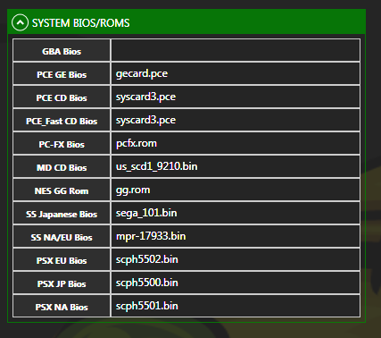

## Operating System Requirements

MedLaunch is built for Microsoft Windows only and has been tested on Windows 7/8/10. It will not work on Windows XP due to the .NET version it is built with.

A 64-bit operating system is preferred, although it should work after a fashion on 32-bit windows with some caveats:

* Sega Saturn games will not be playable (as the Windows builds of Mednafen only support Saturn in x86_64)
* The MedLaunch option to download the latest version of mednafen should NOT be used (as this is hard-coded to download the 64-bit releases of mednafen)
* MedLaunch has not been tested properly on 32-bit Windows - so do this at your own risk

## Software Requirements

MedLaunch is currently built using the [Microsoft .NET Framework 4.5.2](https://www.microsoft.com/en-gb/download/details.aspx?id=42643). You will need at least this version of .NET 4.5 installed for the application to launch.

## Hardware Requirements

* Mouse
* Keyboard
* (Optional) Gamepad/Joystick for Mednafen (although by default most controls are configured within Mednafen to be mapped to the keyboard

MedLaunch is currently a mouse and keyboard affair, with no current plans to implement gamepad control of the UI.

## System Firmware

For a number of emulated systems that Mednafen supports you will need specific BIOS/firmware dumps. From a legal standpoint, it is up to you to acquire these.

The will need to be placed either in the root of your Mednafen directory, the 'firmware' folder within your Mednafen directory, or another location that you can locate through MedLaunch (on a rom by rom basis).

The default ROMs that Mednafen looks for are shown below in the MedLaunch settings:

Mednafen is pretty choosy about which particular firmware you need. You will have to locate the following firmware/BIOSes:

### PSX

|  Filename  |  Purpose  |  Hash  |
|  :-----          |  :-----          |  :-----          |
|  scph5500.bin |  SCPH-5500/v3.0J BIOS image - Required for Japan-region games |  MD5: 8dd7d5296a650fac7319bce665a6a53c  SHA256: 9c0421858e217805f4abe18698afea8d5aa36ff0727eb8484944e00eb5e7eadb|
|  scph5501.bin |  SCPH-5501/v3.0A BIOS image - Required for North America/US-region games |  MD5: 490f666e1afb15b7362b406ed1cea246  SHA256: 11052b6499e466bbf0a709b1f9cb6834a9418e66680387912451e971cf8a1fef |
|  scph5502.bin |  SCPH-5502/v3.0E BIOS image - Required for Europe-region games |  MD5: 32736f17079d0b2b7024407c39bd3050  SHA256: 1faaa18fa820a0225e488d9f086296b8e6c46df739666093987ff7d8fd352c09 |

### Saturn
|  Filename  |  Purpose  |  Hash  |
|  :-----          |  :-----          |  :-----          |
|  sega_101.bin |  BIOS image - Required for Japan-region games |  SHA256: dcfef4b99605f872b6c3b6d05c045385cdea3d1b702906a0ed930df7bcb7deac|
|  mpr-17933.bin |  BIOS image - Required for North America/US-region and Europe-region games |  SHA256: 96e106f740ab448cf89f0dd49dfbac7fe5391cb6bd6e14ad5e3061c13330266f |

### PC-FX
|  Filename  |  Purpose  |  Hash  |
|  :-----          |  :-----          |  :-----          |
|  pcfx.rom |  PC-FX BIOS version 1.00. Recommended BIOS version |  SHA1: 1a77fd83e337f906aecab27a1604db064cf10074|

### Lynx
|  Filename  |  Purpose  |  Hash  |
|  :-----          |  :-----          |  :-----          |
|  lynxboot.img |  512-byte Lynx boot ROM image - this needs to reside in the base mednafen folder and you cannot set its location to something else |  N/A|

### PC-Engine CD

Mednafen is known to work with the following syscard3.pce BIOSes:

|  Filename  |  Purpose  |  Hash  |
|  :-----          |  :-----          |  :-----          |
|  syscard3.pce |  BIOS/PC Engine CD-Rom System BIOS (1988) |  CRC: 2585C0B3  SHA256: 1b4c260326d905bc718812dad0f68089977f427b|
|  syscard3.pce |  BIOS/PC Engine CD-Rom System BIOS (1988) v3.00 [o1] |  SHA256: bf2f90bdc3f82bc4bf28b4e9707530165dedcdd2|

