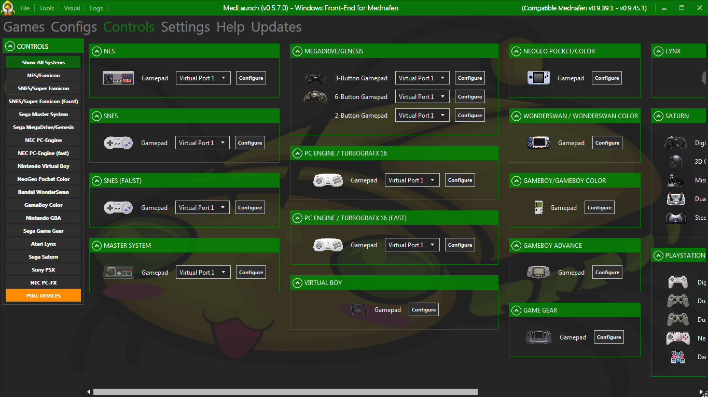

This is a very quick guide for getting MedLaunch setup from scratch.

## 1. Download & Install
### Get the Latest MedLaunch Version

Browse to the MedLaunch latest release page on GitHub <a href="https://github.com/Asnivor/MedLaunch/releases/latest" target="_blank">HERE</a>.

Scroll to the 'Downloads' section at the bottom of the page and click the .zip release:

[ui-browser address="https://github.com/Asnivor/MedLaunch/releases/latest"][/ui-browser]

### Extract to a Folder

Locate the downloaded .zip file and move this to where you want to 'install' MedLaunch. You can then either extract the contents into a new directory, or (depending on your archiving client) right-click and extract into a new folder.

## First Time Configuraton
### Run MedLaunch

Navigate into the folder where you have just extracted your MedLaunch files and double click 'MedLaunch.exe':

MedLaunch will then initialise and setup a new internal database (if one does not exist already).

### Configure Update Check on Start

You will then be forced to choose whether MedLaunch checks for updates on the internet every time it is started:

If you select 'No' here you can always check updates manually through MedLaunch later on.

### Choose Mednafen Directory

MedLaunch (obviously) needs Mednafen to run. You are next presented with this:

Press 'Ok' to proceed.

You are then presented with a Windows folder dialog:

You have to choose a Mednafen folder now. Either:

1. Browse to and select an existing Mednafen folder

or

2. Browse to/create a new empty Mednafen folder

If Mednafen is not detected in the folder you choose, MedLaunch will connect to the internet, download the latest (64bit) Windows version of Mednafen (that MedLaunch supports) and extract it to this folder.

### Import Mednafen Configs

You will then be asked if you wish to parse the existing Mednafen config file information into MedLaunch:

Press 'Yes' unless you can think of a reason not to do this.

## 3. Import Games
### Select System ROM Paths (for ROM based systems)

After a short wait (whilst MedLaunch finishes initialising) you will be presented with an empty Games Library screen:

We now need to add some ROM paths into MedLaunch. Click on the 'Settings' tab and select the 'Game Folders' filter on the left:

For the purpose of this quick tutorial, we are going to setup MedLaunch only for SNES (Super Nintento) games. Click the 'SNES' button in the 'Game Folders' panel and you will be presented with a Windows dialog to choose the folder that contains your SNES ROMs:

Once you have selected a folder, this is saved to the MedLaunch internal database.

### Scan ROMs into Games Library

Now click the 'Games' tab to navigate back to the games library. You now need to ask MedLaunch to scan the SNES folder (and subfolders) for any SNES ROMs and import these into the games library.

Right-click on the 'SNES' ROM filter and select 'Rescan SNES ROMs':

MedLaunch will then scan all files, sub-folders and archives for compatible SNES ROM files, attempt to match these against NoIntro and ToSec data and collate this information ready to import into it's internal database:

If you have a large number of ROMs, this may take some time. Once all ROMs have been scanned, they will be imported into the internal database:

Click 'Ok' and you will be returned to the games library. If SNES ROMs were detected and imported these will now be shown:

### Select System Disc Paths (for disc based systems)

The process for disc-based systems (PSX, Sega Saturn, PC-Engine CD, PCFX) is almost the same as for ROM-based systems, with the following caveat:

* For auto-scan to work, each game's files (.cue, .bin, .ccd, .img etc..) must reside in a per-game sub-directory below the main system directory that you select through MedLaunch.

If the above is not adhered to, then disc-based games will not be imported successfully. In this case you will either need to re-arrange how your disc-based games are organised on disk, or manually add each game using the method below.

### Manual Import of Individual Disc Games

On the 'Games' tab, right click the disc-based system filter you are interested in (PSX, Saturn, PCE-CD, PC-FX) and select 'Manually Import a {system} Game':

In this case we are importing a PSX game.

You will be presented with a Windows file selection dialog. Navigate to the folder that holds the Disc-based game you are interested in:

### Single-Disc Games

If the game is a single-disc game, select one .cue, .ccd or .toc cuesheet file and click 'open'. This will import that game into the games library.

### Multi-Disc Games

If the game is multi-disc, Mednafen requires an .m3u playlist file that references all the needed discs.

If you already have one of these, select it and click 'open'. The game will then be imported.

If you do not already have an .m3u file, CTRL-click all of the discs in the multi-disc set (so they are all selected) and click 'Open'. MedLaunch will then automatically generate an .m3u file for the game (in the same folder) and import this into the database.

! Mednafen Tip: To swap discs in-game the default keys are F8 & F6

## 4. Common Configuration Options
### Configure a System

Nearly all available Mednafen configuration options are available under the 'Configs' tab in MedLaunch. Whereas Mednafen has a generic configuration options (that apply to all systems) and system specific configuration options (that apply only to certain emulated systems), MedLaunch maintains completely separate configurations for each emulated system:

You can see above that the 'GENERAL', 'AUDIO', 'OSD', 'VIDEO' and 'CONTROL' configuration areas are generic amongst all systems. The MedLaunch database however maintains separate config information for these per-emulated-system.

You can click one of the System Filters on the left hand side to bring up the specific config for that system.

### Some Basic Config Options

Mednafen is very complex with the number of configuration options it allows. It will run pretty well 'out-of-the-box' with the default configuration but there are however a few basic options that you should be aware of in order to get up and running.

#### General

##### Autosave
If this setting is enabled, the game's state will automatically be saved to disk when you exit the game. When you next run the game, that state will automatically be loaded so you can carry on where you left off.

##### Cache CD
If you are emulating a disc-based system (PSX, Saturn, PCFX or PCE-CD) this option forces mednafen to load all disc images for that game into memory first before running the game. This uses more system memory but can reduce stutter that is sometimes a problem when reading disc images from HDD.

##### Disable Desktop Composition
This forces windows aero to be disabled when launching mednafen.

##### Full Screen
Pretty self-explanatory. This option forces mednafen to full screen (as opposed to windowed) when it starts.

! Mednafen Tip: Fullscreen can be toggled in-game by using ALT-ENTER. However, this setting will **NOT** be remembered.

#### Per-System

Each emulated system has its own list of specific config options that are visible when you click on the system filter in MedLaunch.

If we take a look at the Megadrive/Genesis for example:

There are a number of things here that you may want to change the first time you play.

##### Window Scaling
The X and Y values here vary the scale if you are running medanfen in Windowed mode. So for example, if you wanted to make the mednafen window 3 times bigger for the megadrive, you would change X to 3 and Y to 3.

##### Input Devices
Each different system will have a number of different virtual 'Input Devices' in mednafen. These can be changed in MedLaunch on a per-system basis. For example, if you wanted 'Input Device Port 1' on the Megadrive to be a 6-button gamepad rather than the standard 3-button model, you would make this change here.

#### Saving Configurations

! If you make any changes to a system config on the 'Configs' tab, you must click the 'SAVE CHANGES' button (or click on another system filter in 'Configs'. If you do not do this, the changes will not be saved when you next launch a game.

### Acquire BIOS/Firmware

Please see the [Requirements](https://medlaunch.info/documentation/en/introduction/requirements#system-firmware) section for more information on requried Firmware/BIOSes.

## 5. Controller Configuration

Traditionally custom keyboard/controller setup is done through Mednafen itself whilst the game is running. These changes are then saved to the Mednafen config file.

MedLaunch introduces a way to configure the virtual controllers in its GUI using the 'Controls' tab:

Because of the way the mednafen config file is set out, there are separate options to configure the bindings for various emulated devices on various virtual ports that mednafen provides.

### Default Mednafen Bindings

By default, mednafen is set up with default key-bindings for some emulated systems. These can be found in the mednafen documentation (below):

* <a href="https://mednafen.github.io/documentation/lynx.html#Section_default_keys" target="_blank">Atari Lynx</a>
* <a href="https://mednafen.github.io/documentation/gb.html#Section_default_keys" target="_blank">Nintendo GameBoy / GameBoy Color</a>
* <a href="https://mednafen.github.io/documentation/gba.html#Section_default_keys" target="_blank">Nintendo GameBoy Advance</a>
* <a href="https://mednafen.github.io/documentation/ngp.html#Section_default_keys" target="_blank">NeoGeo Pocket / Pocket Color</a>
* <a href="https://mednafen.github.io/documentation/nes.html#Section_default_keys" target="_blank">Nintendo Entertainment System / Famicom Disk System (NES/FDS)</a>
* <a href="https://mednafen.github.io/documentation/pce.html#Section_default_keys" target="_blank">PC Engine / PCE-CD / TurboGrafx 16 / SuperGrafx</a>
* <a href="https://mednafen.github.io/documentation/pcfx.html#Section_default_keys" target="_blank">PC-FX</a>
* <a href="https://mednafen.github.io/documentation/ss.html#Section_default_keys" target="_blank">Sega Saturn</a>
* <a href="https://mednafen.github.io/documentation/psx.html#Section_default_keys" target="_blank">Sonly Playstation</a>
* <a href="https://mednafen.github.io/documentation/snes.html#Section_default_keys" target="_blank">Super Nintendo Entertainment System (SNES)</a>
* <a href="https://mednafen.github.io/documentation/wswan.html#Section_default_keys" target="_blank">Bandai WonderSwan / WonderSwan Color</a>

### Setup Custom Bindings

! Mednafen Tip: You can configure your keyboard/gamepad bindings from within Mednafen if this is easier for you. ALT-SHIFT-1 will configure bindings for the emulated device assigned to virtual port 1. ALT-SHIFT-2 - the bindings for the emulated device assigned to virtual port 2, etc...

In this example, we will configure the standard SNES gamepad on Virtual Port 1:

Ensure that 'Virtual Port 1' is selected (and also make sure under the 'Configs' tab -> SNES, that 'Port 1 Input Device' is set to 'Gamepad') and click the 'Configure' button. This will open the configuration page for this specific virtual device on this virtual port:

You can see that the 'Primary' column is already populated with the default keyboard bindings for Mednafen. Currently MedLaunch only shows these values as they are in the Mednafen config file.

Left click in one of the text boxes and the box will turn RED. This signifies that MedLaunch is waiting for your to press a key (or a gamepad/joystick button/axis):

The translated value you entered will be put in the textbox and the focused box will change to the next primary binding option. Work your way through all the bindings and set them up as you require.

!!! When you reach the end of the primary column, it will move on to the secondary column. You can stop here if you dont wish to configure this. At any point in this process you can click in a different cell to restart configuration from that point.

You can also right-click in a cell to bring up a list of pre-determined mouse binds that you can select:

When you are happy with the binding configuration, click 'OK' and the bindings will be saved to the mednafen config file in the mednafen directory.

You also have the option of undoing all changes or cancelling.

!!!! This is the only part of MedLaunch that saves directly to the Mednafen configuration file in the mednafen directory (mednafen-09x.cfg). Every other setting is stored locally and passed to mednafen through the command line on game launch.

!! IMPORTANT: MedLaunch only detects connected physical controllers when it initalises. If you have connected a USB gamepad etc.. after you have started MedLaunch, you will have to return to the 'Controls' tab and click the orange 'POLL DEVICES' button in the bottom left of the screen. After this is done, MedLaunch should be able to detect your gamepad input when configuring bindings.

## 6. Play a Game

At this point, you will have scanned games into MedLaunch, setup some config settings and configured controller bindings for a system (or systems). Launching a game could not be simpler.

Navigate back to the 'Games' tab and double-click the game you wish to launch. MedLaunch will then attempt to start the game:

When the game launches, MedLaunch will minimise.

When you have finished playing, close the Mednafen window (or press ESC). This will quit mednafen and MedLaunch will pop back up.

## What now?

This was a very basic tutorial on using MedLaunch, but there are many other features and settings to play with. Check out the rest of the documentation that deals with everything in more detail.