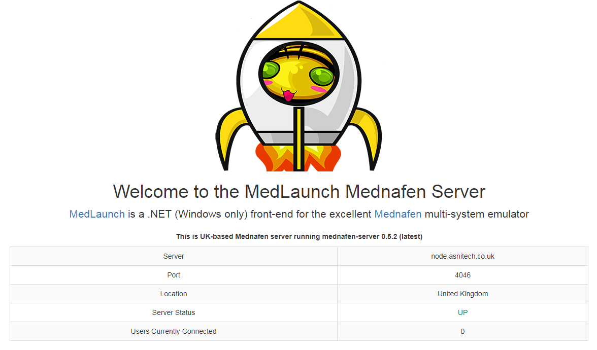

The MedLaunch team maintains a mednafen server (version 0.5.2) hosted in the UK. This is pre-populated in the 'Server' section under MedLaunch settings.

You can also see more info about the server by going to its landing page: [http://uk.medlaunch.info](http://uk.medlaunch.info)

[ui-browser address="http://uk.medlaunch.info"]

[/ui-browser]